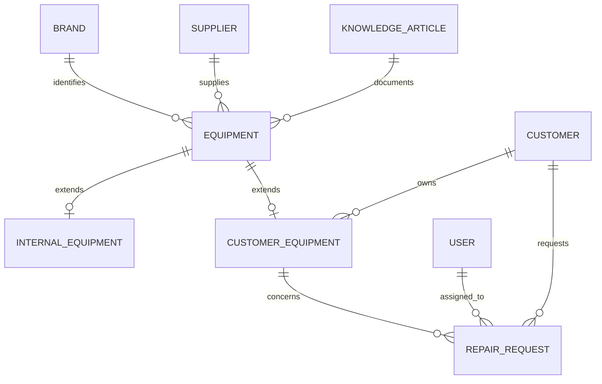
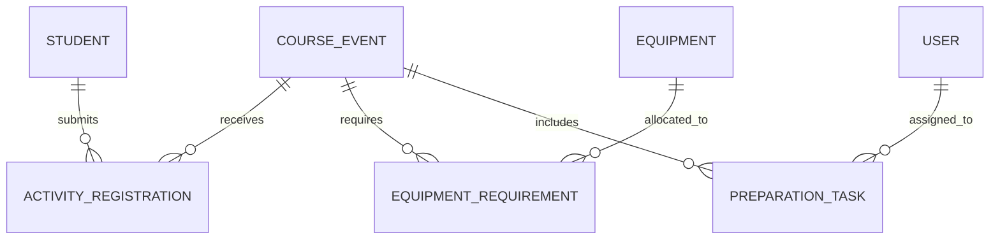
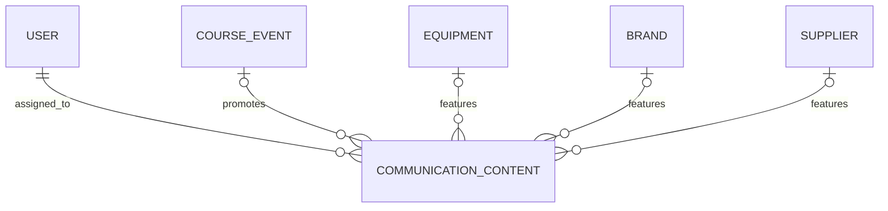

# Juggle Jungle - ServiceNow Operational Platform

A portfolio project detailing the design and development of a custom ServiceNow application. 
Demo records, users, group memberships and attachments are not included in the source-control repository. Test data must be created manually after installation.

## Project Overview

This is a self-directed portfolio project created to demonstrate my ability to analyse business needs, design a ServiceNow solution and implement a complete custom application.

I first created a fictional company, Juggle Jungle, and developed a detailed project brief describing its organisation, employees, existing digital tools and operational processes. Based on this fictional business case, I identified the main issues affecting the company, defined its business needs and proposed a future operating model centred around ServiceNow.

I then translated this analysis into a structured product backlog and role-based user stories with acceptance criteria. These requirements guided the design, development and testing of the ServiceNow application presented in this repository.

### Business Case

Juggle Jungle is a small company specialising in juggling equipment and circus arts. It operates a physical store and an online shop, provides weekly classes, organises events and festivals, repairs customer equipment, and produces educational and promotional content.

The fictional company employs four people covering management, teaching, sales, human resources and technical services. Its operational information was initially distributed across calendars, emails, Google Drive documents and several specialised business tools, making it difficult to obtain a centralised view of ongoing activities.

### Proposed Solution

The project introduces a custom ServiceNow application designed to act as Juggle Jungle’s central operational hub. It structures and connects the company’s internal activities without replacing its existing point-of-sale, e-commerce, accounting or HR systems.

The solution was designed to improve operational visibility, standardise internal processes, clarify employee responsibilities and provide each role with access to the information relevant to their work.

## Key Features

### Repair Management

* Creation and tracking of customer repair requests
* Repairs linked to customers and their equipment
* Assignment to technicians and operational groups
* Priority, repair status, billing status and completion-date tracking
* Email and in-platform notifications for assignments and approaching deadlines

### Equipment Management

* Separate management of shared, internal and customer equipment data
* Monitoring of equipment condition, availability, usage and maintenance
* Tracking of equipment temporarily loaned to customers
* Links between equipment, repairs, suppliers, knowledge articles and activities

### Course and Event Planning

* Planning of classes, workshops and events
* Weekly, monthly, quarterly and yearly recurrence management
* Automatic calculation and update of the next class date
* Management of participating students through activity registrations
* Association of required equipment and preparation tasks with each activity

### Task and Responsibility Management

* Creation and assignment of preparation tasks
* Task status, priority and due-date tracking
* Role-based personal work lists for employees
* Automatic notifications when work is assigned

### Knowledge Management

* Dedicated Juggle Jungle knowledge base
* Structured categories for equipment guidance, maintenance, handling and training
* Article review and publication process
* Links between knowledge articles and relevant equipment

### Communication Planning

* Preparation of content for social media platforms
* Publication-date and content-status tracking
* Communication records linked to courses, events, equipment and other operational information

### Dashboards and Reporting

* Dedicated dashboards for the Director, HR Manager and Technicians
* Visibility into upcoming activities, current repairs and pending tasks
* Equipment availability and administrative-document reporting
* Lists and reports filtered according to each employee’s responsibilities

### Roles and Access Control

* Dedicated users, groups and application roles
* Role-based access to application modules, records and dashboards
* Access controls tested through user impersonation

## Data Model

Juggle jungle application is primarily built on 14 custom tables interconnecting key operational areas.

### Equipment and Repair Management

### Course and Event Management

### Communication Planning

The `Equipment` table acts as the parent of `Internal Equipment` and `Customer Equipment`.

`Activity Registration`, `Equipment Requirement` and `Preparation Task` connect students, equipment and operational responsibilities to the relevant course or event.

## ServiceNow Technologies Used

| ServiceNow technology              | Use in the project                                                                             |
| ---------------------------------- | ---------------------------------------------------------------------------------------------- |
| **App Engine Studio**              | Development of the scoped Juggle Jungle application and its application experiences            |
| **Task-Based Records**             | Use of the ServiceNow Task structure for repair requests and preparation tasks                 |
| **Forms, Lists and Related Lists** | Role-appropriate record layouts, operational lists, filters and linked-record views            |
| **Import Sets and Transform Maps** | Import and transformation of customer data from an external file into the application          |
| **Workflow Studio**                | Record-triggered and scheduled flows for assignments, reminders and recurring activities       |
| **Custom Flow Actions**            | Server-side logic used to calculate the next occurrence of recurring classes                   |
| **Server-Side JavaScript**         | Date processing and recurrence logic using ServiceNow API: `GlideDateTime`             |
| **Notifications and Events**       | Email notifications, in-platform bell notifications and custom event triggering                |
| **Platform Analytics**             | Role-based dashboards, reports, charts and operational record lists                            |
| **Knowledge Management**           | Dedicated knowledge base, categories, article review and publication                           |
| **Users, Groups and Roles**        | Access organised according to the responsibilities of the Director, HR Manager and Technicians |
| **Access Control Lists**           | Table and record access secured through application roles and ACL rules                        |
| **Theme Builder**                  | Custom logo, colours and visual identity for the Juggle Jungle instance                        |
| **Attachments**                    | Storage of equipment images and operational PDF documents on relevant records                  |
| **User Impersonation**             | Functional and permission testing from the perspective of each employee role                   |
| **Git Source Control**             | Versioning and backup of the scoped application in a dedicated GitHub repository               |

## Screenshots

Installation

This application is intended for demonstration and portfolio purposes. It should be imported into a non-production ServiceNow instance.

Prerequisites
A non-production ServiceNow instance
Administrator access
App Engine Studio
Required dependencies:
Task table schema
System Import Sets
A GitHub credential with access to the source repository
Import from Source Control
Create a valid GitHub credential in ServiceNow using Connections & Credentials → Credentials.
Open App Engine Studio.
From the My Apps page, select Import app or Import from source control.
Select HTTPS as the network protocol.

Enter the following repository URL:

https://github.com/Fredbarillon/juggle-jungle-servicenow.git

Select the GitHub credential and the branch containing the application.
Start the import and allow ServiceNow to validate the generated files and checksum.
Select the imported application when the operation is complete.
Post-Installation Configuration

The source-control repository contains the scoped application files but not the complete instance data. After importing the application:

Create or configure the required users and groups.
Assign the imported Juggle Jungle roles.
Add demonstration or operational records.
Configure outbound email if notifications need to be tested.
Verify and test the flows, notifications, dashboards and role-based permissions.

Do not manually edit the generated ServiceNow source files, as external changes may cause a checksum mismatch during import.

