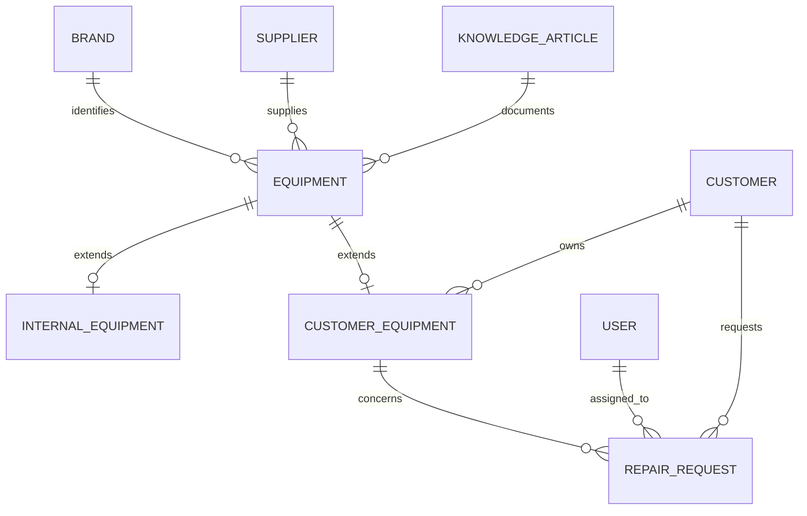
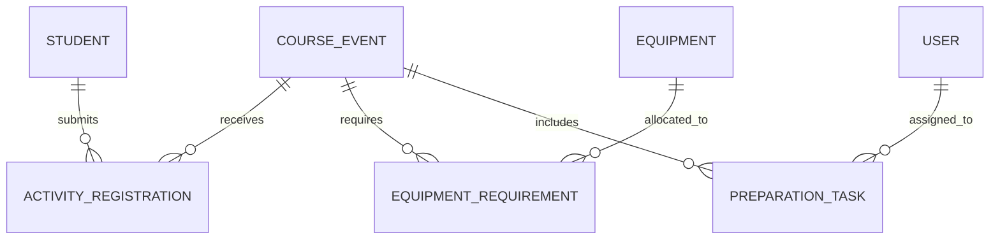
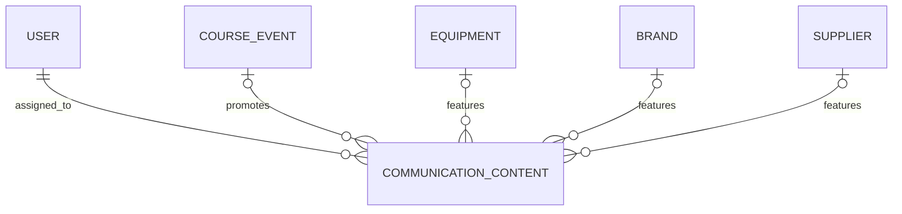

[English](README.md) |

# Juggle Jungle - Plateforme opérationnelle ServiceNow

Un projet de portfolio présentant la conception et le développement d'une application ServiceNow personnalisée.

Les données de démonstration, les utilisateurs, les appartenances aux groupes et les pièces jointes ne sont pas incluses dans le dépôt de contrôle de source. Des données de test doivent être créées manuellement après l'installation.

## Présentation du projet

Ce projet personnel a été réalisé afin de démontrer ma capacité à analyser des besoins métier, concevoir une solution ServiceNow et mettre en œuvre une application personnalisée complète.

J'ai d'abord créé une entreprise fictive, Juggle Jungle, puis rédigé un dossier de projet détaillant son organisation, ses employés, ses outils numériques existants et ses processus opérationnels. À partir de ce cas d'entreprise fictif, j'ai identifié les principales difficultés rencontrées, défini les besoins métier et proposé un futur modèle de fonctionnement centré sur ServiceNow.

J'ai ensuite traduit cette analyse en un backlog produit structuré et en user stories organisées par rôle, avec leurs critères d'acceptation. Ces exigences ont guidé la conception, le développement et les tests de l'application ServiceNow présentée dans ce dépôt.

### Cas d'entreprise

Juggle Jungle est une petite entreprise spécialisée dans le matériel de jonglerie et les arts du cirque. Elle exploite un magasin physique et une boutique en ligne, propose des cours hebdomadaires, organise des événements et des festivals, répare le matériel de ses clients et produit du contenu pédagogique et promotionnel.

L'entreprise fictive emploie quatre personnes qui assurent des missions de direction, d'enseignement, de vente, de ressources humaines et de services techniques. Ses informations opérationnelles étaient initialement réparties entre des calendriers, des e-mails, des documents Google Drive et plusieurs outils métier spécialisés, ce qui rendait difficile l'obtention d'une vue centralisée des activités en cours.

### Solution proposée

Le projet introduit une application ServiceNow personnalisée conçue pour servir de plateforme opérationnelle centrale à Juggle Jungle. Elle structure et relie les activités internes de l'entreprise sans remplacer ses systèmes existants de point de vente, de commerce électronique, de comptabilité ou de ressources humaines.

La solution a été conçue pour améliorer la visibilité opérationnelle, standardiser les processus internes, clarifier les responsabilités des employés et fournir à chaque rôle un accès aux informations utiles à son travail.

[Lien vers la documentation du projet](Juggle_Jungle_Transformation_Numerique_v2_FR.pdf) 

## Fonctionnalités principales

### Gestion des réparations

- Création et suivi des demandes de réparation des clients
- Réparations liées aux clients et à leur matériel
- Affectation aux techniciens et aux groupes opérationnels
- Suivi de la priorité, de l'état de la réparation, du statut de facturation et de la date d'achèvement prévue
- Notifications par e-mail et dans la plateforme lors des affectations et à l'approche des échéances

### Gestion du matériel

- Gestion distincte des informations communes, du matériel interne et du matériel appartenant aux clients
- Suivi de l'état, de la disponibilité, de l'utilisation et de la maintenance du matériel
- Suivi du matériel temporairement prêté aux clients
- Liens entre le matériel, les réparations, les fournisseurs, les articles de connaissance et les activités

### Planification des cours et événements

- Planification des cours, ateliers et événements
- Gestion des récurrences hebdomadaires, mensuelles, trimestrielles et annuelles
- Calcul et mise à jour automatiques de la date du prochain cours
- Gestion des étudiants participants grâce aux inscriptions aux activités
- Association du matériel requis et des tâches de préparation à chaque activité

### Gestion des tâches et des responsabilités

- Création et affectation des tâches de préparation
- Suivi de l'état, de la priorité et de la date d'échéance des tâches
- Listes de travail personnelles adaptées au rôle de chaque employé
- Notifications automatiques lors de l'affectation d'un travail

### Gestion des connaissances

- Base de connaissances dédiée à Juggle Jungle
- Catégories structurées pour le choix, la maintenance, la manipulation et l'utilisation du matériel
- Processus de révision et de publication des articles
- Liens entre les articles de connaissance et le matériel concerné

### Planification de la communication

- Préparation de contenus destinés aux réseaux sociaux
- Suivi de la date de publication et du statut du contenu
- Contenus de communication liés aux cours, événements, équipements et autres informations opérationnelles

### Tableaux de bord et rapports

- Tableaux de bord dédiés au directeur, au responsable RH et aux techniciens
- Visibilité sur les activités à venir, les réparations en cours et les tâches en attente
- Rapports sur la disponibilité du matériel et le statut des documents administratifs
- Listes et rapports filtrés selon les responsabilités de chaque employé

### Rôles et contrôle des accès

- Utilisateurs, groupes et rôles applicatifs dédiés
- Accès aux modules, enregistrements et tableaux de bord selon le rôle
- Contrôles d'accès testés par impersonation des utilisateurs

## Modèle de données

L'application Juggle Jungle repose principalement sur 14 tables personnalisées qui relient les principaux domaines opérationnels.

### Gestion du matériel et des réparations

### Gestion des cours et événements

### Planification de la communication

La table `Equipment` sert de table parente à `Internal Equipment` et `Customer Equipment`.

Les tables `Activity Registration`, `Equipment Requirement` et `Preparation Task` relient les étudiants, le matériel et les responsabilités opérationnelles au cours ou à l'événement concerné.

## Technologies ServiceNow utilisées

| Technologie ServiceNow | Utilisation dans le projet |
| --- | --- |
| **App Engine Studio** | Développement de l'application scoped Juggle Jungle et de ses expériences applicatives |
| **Enregistrements basés sur Task** | Utilisation de la structure Task de ServiceNow pour les demandes de réparation et les tâches de préparation |
| **Formulaires, listes et listes associées** | Mise en page des enregistrements selon les rôles, listes opérationnelles, filtres et vues des enregistrements liés |
| **Import Sets et Transform Maps** | Importation et transformation de données clients provenant d'un fichier externe |
| **Workflow Studio** | Flows déclenchés par des enregistrements ou planifiés pour les affectations, rappels et activités récurrentes |
| **Actions de flow personnalisées** | Logique côté serveur calculant la prochaine occurrence des cours récurrents |
| **JavaScript côté serveur** | Traitement des dates et logique de récurrence avec l'API ServiceNow `GlideDateTime` |
| **Notifications et événements** | Notifications par e-mail, notifications dans la cloche et déclenchement d'événements personnalisés |
| **Platform Analytics** | Tableaux de bord, rapports, graphiques et listes opérationnelles adaptés aux rôles |
| **Knowledge Management** | Base de connaissances dédiée, catégories, révision et publication des articles |
| **Utilisateurs, groupes et rôles** | Accès organisés selon les responsabilités du directeur, du responsable RH et des techniciens |
| **Listes de contrôle d'accès (ACL)** | Sécurisation de l'accès aux tables et aux enregistrements par les rôles applicatifs et les règles ACL |
| **Theme Builder** | Logo, couleurs et identité visuelle personnalisés pour l'instance Juggle Jungle |
| **Pièces jointes** | Stockage d'images du matériel et de documents PDF opérationnels sur les enregistrements concernés |
| **Impersonation des utilisateurs** | Tests fonctionnels et tests des autorisations du point de vue de chaque rôle employé |
| **Contrôle de source Git** | Versionnement et sauvegarde de l'application scoped dans un dépôt GitHub dédié |

## Captures d'écran

## Installation

Cette application est destinée à des fins de démonstration et de portfolio. Elle doit être importée dans une instance ServiceNow hors production.

### Prérequis

- Une instance ServiceNow hors production
- Un accès administrateur
- App Engine Studio
- Les dépendances requises :
  - Task table schema
  - System Import Sets
- Un credential GitHub autorisé à accéder au dépôt source

### Importation depuis le contrôle de source

1. Créez un credential GitHub valide dans ServiceNow depuis **Connections & Credentials → Credentials**.
2. Ouvrez **App Engine Studio**.
3. Depuis la page **My Apps**, sélectionnez **Import app** ou **Import from source control**.
4. Sélectionnez **HTTPS** comme protocole réseau.
5. Saisissez l'URL du dépôt :

   `https://github.com/Fredbarillon/juggle-jungle-servicenow.git`

6. Sélectionnez le credential GitHub et la branche contenant l'application.
7. Lancez l'importation et laissez ServiceNow valider les fichiers générés et le checksum.
8. Sélectionnez l'application importée lorsque l'opération est terminée.

### Configuration après l'installation

Le dépôt de contrôle de source contient les fichiers de l'application scoped, mais pas l'ensemble des données de l'instance. Après l'importation :

- Créez ou configurez les utilisateurs et groupes nécessaires.
- Attribuez les rôles Juggle Jungle importés.
- Ajoutez des enregistrements de démonstration ou des données opérationnelles.
- Configurez l'envoi des e-mails si les notifications doivent être testées.
- Vérifiez et testez les flows, les notifications, les tableaux de bord et les autorisations basées sur les rôles.

Ne modifiez pas manuellement les fichiers source générés par ServiceNow, car des modifications externes peuvent provoquer une incompatibilité du checksum lors de l'importation.
